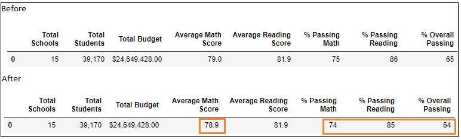

# School District Analysis

## Project Overview

I was tasked to help Maria, the Chief Data Scientist for the ***PyCity School District***, in an analysis of overall district performance, individual school performance, Top and Bottom performing schools, Average Math and Reading scores for each grade from each school, Scores by school spending, Scores by school size and Scores by school type. This analysis will help the School board make strategic decisions regarding future school budgets and priorities based on the standardized test scores and current school funding

To complete the task, I had to use Anaconda and the Jupyter Notebook.

## Purpose of this Analysis

I completd my analysis as requested, but then the school board notified Maria and her supervisor that the `students_complete.csv` file shows evidence of academic dishonesty; specifically, reading and math grades for **Thomas High School** ninth graders appear to have been altered. 

Although the school board did not know the full extent of the academic dishonesty, they wanted to uphold state-testing standards and turned to Maria for help. Maria asked me to replace the math and reading scores for Thomas High School with NaNs while keeping the rest of the data intact. 

Once I replace the math and reading scores, Maria would like me to repeat the school district analysis that I did earlier and write up a report to describe how these changes affected the overall analysis.

## Analysis Steps

In the initial analyis (see the code file `PyCitySchools.ipynb`), we created a script to perform the required analysis.

For this analysis, we had to only change the **9th** grade **Math** and **Reading** scores for the school **Thoams High School**, and run the script that I created for the initial analysis.

Below are the steps that were undertaken

1. Installed `numpy` using the command `conda install numpy`

**Image 1 (below): Installing numpy**


2. Imported numpy 
`import numpy as np`

3. Used the `loc` method on the **student_data_df** to select **all** the reading scores from the **9th** grade at **Thomas High School** and replaced them with NaN.
```
student_data_df.loc[(student_data_df["school_name"] == "Thomas High School") & (student_data_df["grade"] == "9th") & (student_data_df["reading_score"] > 0), "reading_score"] = np.nan
```
4. Refactored the code in previous step to replace the **math** scores with NaN.

```
student_data_df.loc[(student_data_df["school_name"] == "Thomas High School") & (student_data_df["grade"] == "9th") & (student_data_df["math_score"] > 0), "math_score"] = np.nan
```
5. Checked the student data for NaN's using the code `student_data_df.tail(10)`

**Image 2 (below): Output of student data after replacing with NaN's (with some NaN entries highlighted)**


6. Repeated the **school district analysis** that was done in Module 4 to recreate the metrices

## Analysis Results

Below are the answers to questions realated to how the replacement affected various metrices.

#### 1. How is the ***district*** summary affected?

*There  is a slight downward change in district averages*
* Average Math Score:       Decreased by 0.1 (from 79.0 to 78.9)
* Average Reading Score:    No change (from 81.9)
* Passing Math %:           Decreased by 1% (from 75 to 74)
* Passing Reading %:        Decreased by 1% (from 86 to 85)
* Overall Passing %:        Decreased by 1% (from 65 to 64)

**Image 3 (below): Affect of the replacement on DISTRICT summary**



#### 2. How is the ***school*** summary affected?

*The induvidual scores of schools except ***Thomas High School*** haven't changed*

*Drastic decrease in the Passing Math %, Passing Reading % and Overall Passing % of ***Thomas High School***.*
* Passing Math % decreased from 93.27% to 66.91%
* Passing Reading % decreased from 97.31% to 69.66%
* Overall Passing % decreased from 90.95% to 65.08%

**Image 4 (below): Affect of the replacement on SCHOOL summary**


#### 3. How does the replacement affect ***Thomas High School’s*** performance relative to the other schools?
Before the replacement, ***Thomas High School*** was placed 2nd amongst the 15 school according to **Overall Passing %**. With the changes, it lost 6 places and moved to the 8th spot.

The schools that were earlier placed between 3rd and 8th, all gained one spot.

#### 4. How does the replacement affect the Math and Reading scores by ***grade***
*As the changes were made only to the scores of the 9th grade of **Thomas High School**, only 2 entries were affected, all others remained the same*
* The 9th grade maths scores of **Thomas High School** were changed from 83.6 to nan
* The 9th grade reading scores of **Thomas High School**were changed from 83.7 to nan 

**Image 5 (below): Affect of the replacement on Math and Reading scores by GRADES**


#### 5. How does the replacement affect the scores by ***school spending***
*As **Thomas High School** fell in the $630-$644 range, changes were seen in this range, the other 3 ranges were unaffected*
* The  Passing Math % for the **$630-$644 range** dropped from 73% to 67%
* The Passing Reading % for the **$630-$644 range** dropped from 84 to 77%
* The Overall Passing % for the **$630-$644 range** dropped from 63% to 56%

**Image 6 (below): Affect of the replacement on scores by SCHOOL BUDGET**


#### 6.  How does the replacement affect the scores by ***school size***
*As **Thomas High School** fell in the Medium-Size-School category, changes were seen in this range, the other 2 categories were unaffected*
* The  Passing Math % for the **Medium-Size-School category** dropped from 94% to 88%
* The Passing Reading % for the **Medium-Size-School category** dropped from 97 to 91%
* The Overall Passing % for the **Medium-Size-School category** dropped from 91% to 85%

**Image 7 (below): Affect of the replacement on scores by SCHOOL SIZE**


#### 7.  How does the replacement affect the scores by ***school type***
*As **Thomas High School** fell in the Charter School type, changes were seen in this School type, the other type was unaffected*
* The  Passing Math % for **Charter Schools** dropped from 94% to 90%
* The Passing Reading % for **Charter Schools** dropped from 97 to 93%
* The Overall Passing % for **Charter Schools** dropped from 90% to 87%

**Image 7 (below): Affect of the replacement on scores by SCHOOL TYPE**


<<<<<<<<<<<<<<<<<<<<<<<<<<<<<<<<<<<<<<<<<<<<<<<<<<<<<<<<<<<<<<<<<<<<<<<<<<<<<<<<<<<<<<<<<<<<<<<<

For this part of the Challenge, write a report that summarizes your updated analysis and compares it with the results from the module.

The analysis should contain the following:

Overview of the school district analysis: Explain the purpose of this analysis.

Results: Using bulleted lists and images of DataFrames as support, address the following questions.

<<>>>>>>>>>>>>>>>>>>>>>>>>>>>>>>>>>>>>>>>>>>>>>>>>>>>>>>>>>>>>>>>>>>>>>>>>>>>>>>>>>>>>>>>>>>>>>>>>>>


## Summary


<<>>>>>>>>>>>>>>>>>>>>>>>>>>>>>>>>>>>>>>>>>>>>>>>>>>>>>>>>>>>>>>>>>>>>>>>>>>>>>>>>>>>>>>>>>>>>>>>>>>
Summarize four major changes in the updated school district analysis after reading and math scores for the ninth grade at Thomas High School have been replaced with NaNs.

<<>>>>>>>>>>>>>>>>>>>>>>>>>>>>>>>>>>>>>>>>>>>>>>>>>>>>>>>>>>>>>>>>>>>>>>>>>>>>>>>>>>>>>>>>>>>>>>>>>>
========================================

Deliverable 3 Requirements
Structure, Organization, and Formatting (7 points)
The written analysis has the following structure, organization, and formatting:

There is a title, and there are multiple sections (2 pt).
Each section has a heading and subheading (3 pt).
Links to images are working, and code is formatted and displayed correctly (2 pt).
Analysis (18 points)
The written analysis has the following:

Overview of the school district analysis:

The purpose of this analysis is well defined (3 pt).
Results:

There is a bulleted list that addresses how each of the seven school district metrics was affected by the changes in the data (10 pt).
Summary:

There is a statement summarizing four major changes to the school district analysis after reading and math scores have been replaced (5 pt).

========================================
